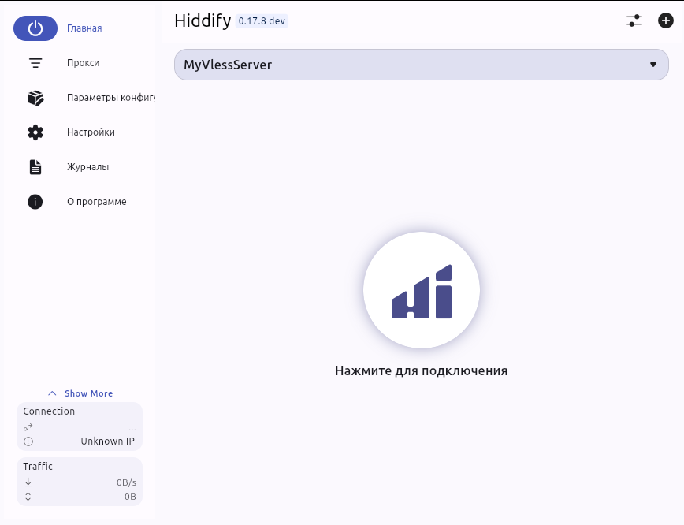

# How to VPN

Original guide on habr: [habr.pdf](habr.pdf) begin from 7 page

## You need

Server with Debian, IPv4 not in Russia

[How to buy it](SERVER.md)

## Setup server

Connect to server from your terminal like `ssh root@100.100.100.100` and enter password. Also you have online virtual terminal on site.

In server's terminal do:

1. `bash -c "$(curl -L https://github.com/XTLS/Xray-install/raw/main/install-release.sh)" @ install` - copy this text and paste to terminal with CTRL+SHIFT+V, then Enter

2. Run also

`xray uuid` copy output to another place(select & CTRL+SHIFT+C) — сгенерирует UUID, это что‐то типа логина пользователя

`xray x25519` copy output to another place(select & CTRL+SHIFT+C) — сгенерирует приватный и публичный ключ сервера

3. Нужно выбрать под какой сайт вы будете маскироваться.

- это должно быть какой‐то очень популярный иностранный сайт, желательно
не связанный с политикой и СМИ.
- какой‐нибудь ресурс, которым пользуются много людей и компаний, который цензоры до последнего не будет блокировать без большой нужды, чтобы не разломать пол‐интернета (и нет, это не гугл). Не обязательно использовать главный домен сайта, можно брать какие‐то из поддоменов.
 
Будет что-то типа `https://www.microsoft.com` (не лучший выбор)

4. Настройка конфига, файл [config.json](config.json) копируем шаблон в отдельное место

И вместо полей меняем значения на полученные до этого. Получаем содержимое, которое будем вставлять далее.

5. `apt install -y nano` - устанавливаем редактор кода(если не получилось вначале команды добавляем `sudo` и вводим еще пароль)

Открываем редактор кода, команда:
`nano /usr/local/etc/xray/config.json`

Вставляем все содержимое json конфига настроенного(копируем и CTRL+SHIFT+V) и делаем CTRL+S, CTRL+X(сохранить, закрыть)

6. Делаем `systemctl restart xray` и 
`systemctl status xray`, если статус `active (running)` то значит все получилось.

7. Собираем ссылку для клиента, чтобы можно было легко и быстро добавлять
подключение к вашему прокси на всевозможных устройствах и раздавать доступ родным и
друзьям. Ссылка будет выглядеть так:

`vless://ваш_UUID@IP_адрес_вашего_сервера:443/?encryption=none&type=tcp&sni=домен_сайта&fp=chrome&security=reality&alpn=h2&flow=xtls-rprx-vision&pbk=ваш_публичный_ключ&packetEncoding=xudp#Имя_Этого_Соединения`

> Проверяем что не было переноса строки в командах и любом тексте!

## Setup your device

At the end of setup server and check that xray is active, you will have link `vless://` with settings of your server and e.t.c. 

Next download app like Hiddify/NekoBox or another app supports vless and load this link in it, you will have connection.

**Hiddify accepts only loading from buffer! You need copy link to clipboard, and then load it in hiddify.**

> При первом запуске он предлагает выбрать страну, и если вы выберете Россию, то
автоматически применятся правила, направляющие трафик до иностранных ресурсов через ваш
прокси, а до российских сайтов — напрямую, ничего дополнительно настраивать не надо. А если
вы выберете "Другое", то на прокси пойдет весь ваш трафик.

Теперь для своего любого устройства скачиваем приложение, вставляем ссылку из буффера и все!

> Для андроид приставок(без нормального копирования в буффер) работает так: 
> 1. Ставим на приставку приложение [Take Notes](https://play.google.com/store/apps/details?id=io.github.visnkmr.kagaz)
> 2. Либо вводим руками либо Remote Control с телефона управляем приставкой вставляя в Take Notes текст с ссылкой
> 3. Далее отправляем, выделяем и Copy Text - все скопировали! Теперь осталось вставить в hiddify

Example with Hiddify:



*****

## Возможные проблемы

Видите бесконечно Таймаут в Hiddify, заходите через сайт в консоль(или по ssh)
Если после `sudo systemctl status xray` видите disable, значит надо что то исправить

1. Переполнение логов

`Data hash table of /run/log/journal/####/system.journal has a fill level` сообщения

Либо:

```bash
nano /etc/systemd/journald.conf
```
Меняем `SystemMaxUse=5000M` и `MaxRetentionSec=50000` теперь логи будут занимать не больше 5Гб и обновляться каждые пол дня

```bash
sudo systemctl restart systemd-journald
```

Либо делать 

```bash
# Rotate the current journal file
sudo journalctl --rotate

# Vacuum journals to keep only 200M worth of logs
sudo journalctl --vacuum-size=5000M

# Or keep only the last 7 days of logs
sudo journalctl --vacuum-time=1d
```

Далее 

```bash
sudo systemctl restart xray
sudo systemctl status xray
```

Перезагрузка сервера:
```bash
sudo systemctl reboot
```
